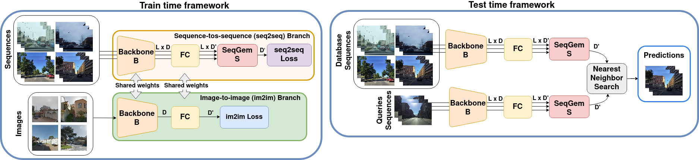

# JIST: Joint Image and Sequence Training for Sequential Visual Place Recognition

<p align="center">
  
    <br/><em>Overview of the JIST framework.</em>
</p>

This is the official repository for the paper "[JIST: Joint Image and Sequence Training for Sequential Visual Place Recognition](https://ieeexplore.ieee.org/document/10339796)". It can be used to reproduce results from the paper while also experiment with different aggregations of sequential descriptor methods for Visual Place Recognition.

## Install Locally
Create your local environment and then install the required packages using:
``` bash
pip install -r pip_requirements.txt
```

## Datasets
The experiments in the paper use two main datasets Mapillary Street Level Sequence (MSLS) and Oxford RobotCar.
For downloading them you can refer to the repo of our previous paper <a href="https://github.com/vandal-vpr/vg-transformers#datasets">here</a>.
- for MSLS, download the dataset from the official website, and format it using the instructions at the link above
- for Robotcar, at the repo link above we provide from GDrive an already pre-processed version of the dataset 

In this work we also use the SF-XL dataset, which in total is about 1 TB, although we only use the `processed` subset as done in CosPlace, which is around 400 GB. More info in [CosPlace](https://github.com/gmberton/CosPlace). 
You can request the download, specifying the processed version of the dataset, using this form  [_here_](https://forms.gle/wpyDzhDyoWLQygAT9).

## Run Experiments
Once the datasets are ready, we can proceed running the experiments with the architecture of choice.

**NB**: to build MSLS sequences, some heavy pre-processing to build data structures is needed. The dataset class will automatically cache this,
so to compute them only the first time. Therefore the first experiment that you ever launch will take 1-2 hours to build this structures which will
be saved in a `cache` directory, and following experiments will then start quickly. Note that this procedure caches everything with relative paths,
therefore if you want to run experiments on multiple machines you can simply copy the `cache` directory.
Finally, note that this data structures must be computed for each sequence length, so potentially in `cache` you will have a file for each sequence_length
that you want to experiment with. You can also precompute them with the following command:
```bash
python cache_dataset_datastruct.py --msls_folder /path/to/msls --seq_len SL
```

To replicate our results you can train a model as follows:

```bash
python train_double_dataset.py --exp_name exp_name \
    --dataset_folder /path/to/sf_xl/processed \
    --seq_dataset_path /path/to/msls \
    --aggregation_type seqgem 
```

### Evaluate trained models 
It is possible to evaluate the trained models using:
``` bash 
python main_scripts/evaluation.py \
	--resume <path trained model> --seq_dataset_path /path/to/dataset
```

### Download trained models
You can download our JIST model with a ResNet-18 backbone and SeqGem from [this Google Drive link](https://drive.google.com/file/d/1F6eVrR-0LseE-tfbT8Y8WT92_O11lt5o/view?usp=sharing).

## Acknowledgements

Parts of this repo are inspired by the following repositories:
- [SeqVLAD](https://github.com/vandal-vpr/vg-transformers)
- [CosFace](https://github.com/MuggleWang/CosFace_pytorch/blob/master/layer.py)
- [CosPlace](https://github.com/gmberton/CosPlace)

## Cite
Here is the bibtex to cite our paper

```
@ARTICLE{Berton_2023_Jist,
  author={Berton, Gabriele and Trivigno, Gabriele and Caputo, Barbara and Masone, Carlo},
  journal={IEEE Robotics and Automation Letters}, 
  title={JIST: Joint Image and Sequence Training for Sequential Visual Place Recognition}, 
  year={2023},
  volume={},
  number={},
  pages={1-8},
  doi={10.1109/LRA.2023.3339058}
}
```
